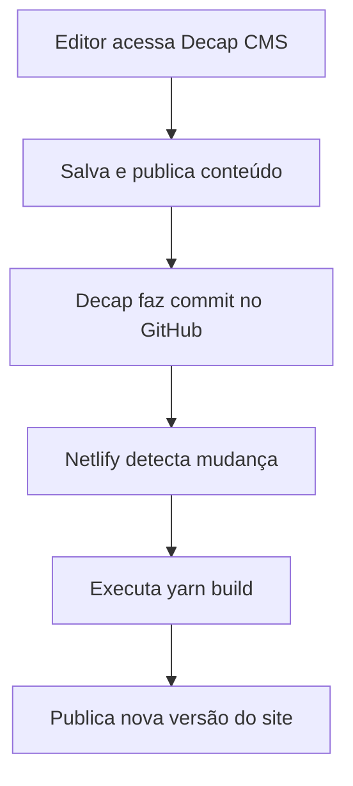

# 📘 Guia RE.AI.s - Documentação do sistema e API

Este projeto é o centro de documentação e referência da API para o nosso ecossistema de serviços no mercado imobiliário. O objetivo é fornecer um guia completo, claro e acessível para desenvolvedores, parceiros e clientes que desejam integrar-se às nossas soluções.

---

## ✨ Funcionalidades

- **📚 Documentação Detalhada:** Guias passo a passo para utilizar nossos serviços de forma eficiente.
- **🔌 Referência de API:** Endpoints completos para `Imóvel`, `Empreendimento`, `Empresa` e `Localização`.
- **🔎 Busca Integrada:** Encontre rapidamente as informações que você precisa.
- **📰 Blog Integrado:** Acompanhe atualizações, novidades e comunicados técnicos.
- **📱 Design Responsivo:** Acesse a documentação de qualquer dispositivo.

---

## 🧱 Arquitetura

O projeto utiliza uma stack moderna e enxuta baseada em Jamstack:

- **Docusaurus:** Gera o site estático da documentação.
- **Decap CMS:** Permite edição de conteúdo via interface amigável (ex: `/admin/`).
- **Netlify:** Hospeda, constrói e distribui o site automaticamente a partir do Git.

### 🔧 Sobre o Decap CMS

> *Anteriormente conhecido como Netlify CMS.*

- Interface gráfica para gerenciar conteúdo (sem necessidade de programar).
- Todo conteúdo é salvo como **código versionado** no repositório Git (commits automáticos).
- Configuração centralizada no arquivo `static/admin/config.yml`.

### 🌍 Sobre o Netlify

- CDN global para carregamento rápido e seguro do site.
- Integração com GitHub para deploy automático via CI/CD.
- Executa o build do projeto (`yarn build`) e publica a versão mais recente.

---

## 🔁 Fluxo de Trabalho



Resultado: **um site estático, versionado, seguro e atualizado em tempo real.**

---

## 🚀 Como Rodar Localmente

### ✅ Pré-requisitos

- Node.js v18+  
- Yarn (recomendado) ou npm

### 📦 Instalação

```bash
git clone https://github.com/ian-cunha/guia-reais.git
cd guia-reais
yarn install  # ou npm install
```

### ▶️ Executar em Modo de Desenvolvimento

```bash
yarn start
```

> Acesse `http://localhost:3000` no navegador.

O site será recarregado automaticamente ao salvar qualquer alteração.

---

## ⚙️ Comandos Úteis

| Comando            | Ação                                             |
|--------------------|--------------------------------------------------|
| `yarn start`       | Inicia o servidor de desenvolvimento             |
| `yarn build`       | Gera a versão estática para produção             |
| `yarn deploy`      | (opcional) Deploy manual se configurado          |

---

## 🛠 Contribuindo

Contribuições são bem-vindas!  
Você pode abrir issues, enviar sugestões ou criar pull requests.

---

## 📄 Licença

Distribuído sob a licença MIT. Consulte o arquivo `LICENSE` para mais informações.

---

## 🌐 Links Importantes

- 📘 **Documentação Online:** [https://guia.reaisystems.com.br](https://guia.reaisystems.com.br)
- 💬 **Contato:** iancunha20@gmail.com
